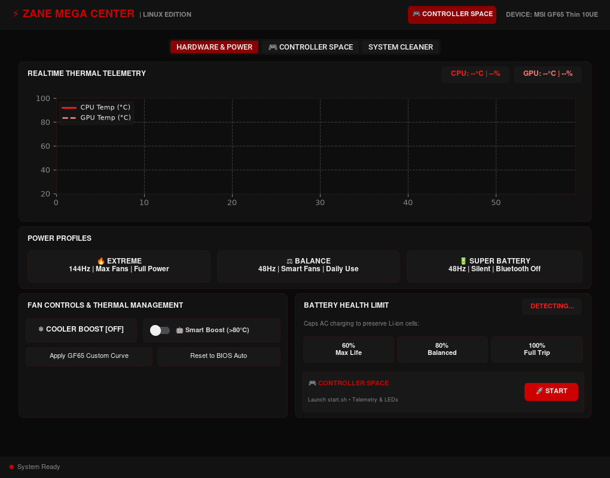
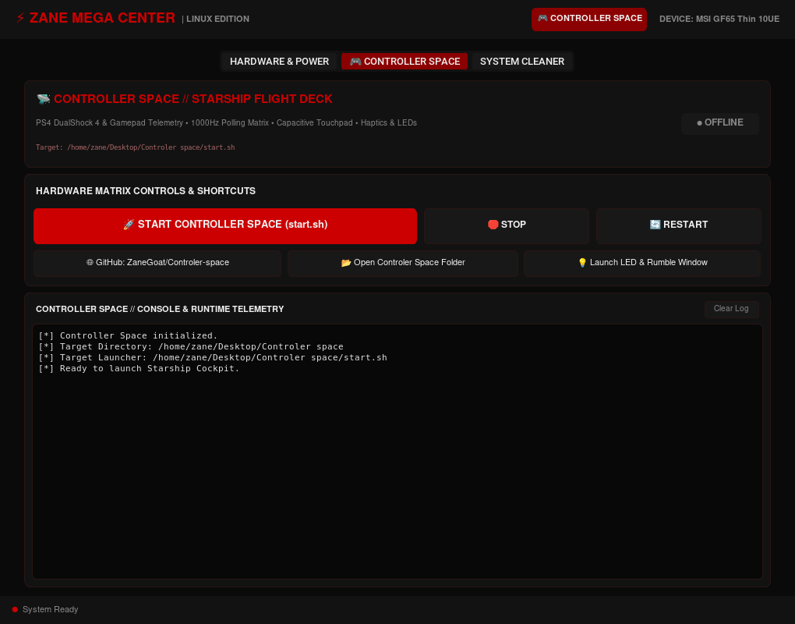
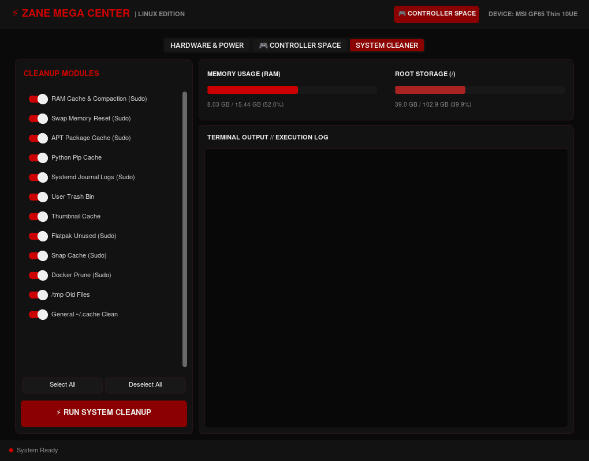
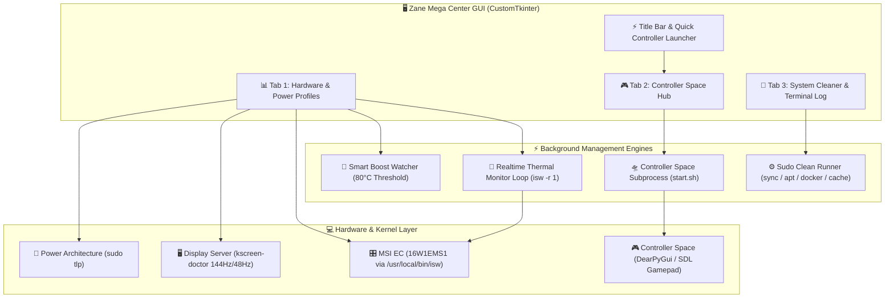

<div align="center">

```
  ███████╗ █████╗ ███╗   ██╗███████╗    ███╗   ███╗███████╗ ██████╗  █████╗ 
  ╚══███╔╝██╔══██╗████╗  ██║██╔════╝    ████╗ ████║██╔════╝██╔════╝ ██╔══██╗
    ███╔╝ ███████║██╔██╗ ██║█████╗      ██╔████╔██║█████╗  ██║  ███╗███████║
   ███╔╝  ██╔══██║██║╚██╗██║██╔══╝      ██║╚██╔╝██║██╔══╝  ██║   ██║██╔══██║
  ███████╗██║  ██║██║ ╚████║███████╗    ██║ ╚═╝ ██║███████╗╚██████╔╝██║  ╚═╝
  ╚══════╝╚═╝  ╚═╝╚═╝  ╚═══╝╚══════╝    ╚═╝     ╚═╝╚══════╝ ╚═════╝ ╚═╝  ╚═╝
              — U L T I M A T E   S Y S T E M   M A T R I X —
```

# ⚡ ZANE MEGA CENTER ⚡
### *Ultimate Hardware Tuning, Thermal Telemetry & Controller Space Command Deck*

[](https://python.org)
[](https://github.com/TomSchimansky/CustomTkinter)
[](#hardware-controls)
[](#overview)
[](#quick-start)
[](#theme--styling)

<br/>



*Live System Telemetry — Real-time Thermals, Power Matrix, Fan Curves & Direct Controller Space Command Link*

---

</div>

## 🌌 Overview

**Zane Mega Center** is a high-performance system tuning suite and hardware telemetry cockpit built for Linux on the **MSI GF65 Thin 10UE** (and compatible hardware). Designed with an aggressive, pure **Black & Red Cyberpunk / MSI Racing** aesthetic, it unites real-time hardware telemetry, active EC fan curve management, battery longevity protection, a deep one-click system cleaner, and native command integration with [**Controller Space**](https://github.com/ZaneGoat/Controler-space).

Whether you are pushing your system to the edge in **Extreme Mode**, monitoring thermal headroom with live 60-second telemetry graphs, maintaining Li-ion cell health, or launching your controller flight deck, Zane Mega Center provides instantaneous, centralized command.

---

## ⚡ Key Modules & Flight Deck Capabilities

### 📊 1. Realtime Thermal Telemetry
- **Live 60-Sample Waveform Plotter**: Integrated Matplotlib canvas rendering CPU and GPU temperature curves dynamically updated via asynchronous telemetry threads.
- **Instant Thermal Badges**: Real-time readouts showing CPU temperature, fan percentage/RPM, and GPU temperature.
- **Embedded ISW Integration**: Direct interface with the Embedded Controller (EC section `16W1EMS1`) for zero-overhead, hardware-level sensor readings.

### 🔥 2. Power Profiles & Display Switching
- **🔥 Extreme Mode**: Engages 144Hz high-refresh display output (`kscreen-doctor`), unblocks Bluetooth, switches TLP to high-performance AC mode, and turns on Cooler Boost.
- **⚖️ Balance Mode**: Switches display to power-efficient 48Hz, activates smart automatic fan curves, and restores balanced TLP defaults.
- **🔋 Super Battery Mode**: Forces 48Hz display refresh, blocks Bluetooth radios via `rfkill`, sets TLP to aggressive battery savings, and silences fans.

### ❄️ 3. Fan Controls & Thermal Management
- **❄️ Cooler Boost [ON/OFF]**: Instant hardware trigger overriding the EC to drive dual cooling fans to 100% maximum RPM.
- **🤖 Smart Boost Thermostat**: Intelligent background watcher that automatically engages Cooler Boost if the CPU reaches or exceeds **80°C**, and gracefully restores automatic fan curves once temperatures cool below **70°C**.
- **Secondary Fan Curves**: Single-click toggles to apply the custom GF65 curve or restore factory BIOS auto curves.

### 🔋 4. Battery Health Preserver
- **Direct EC Charge Capping**: Extends Li-ion battery lifecycle by capping maximum AC charge levels directly in the laptop's Embedded Controller:
  - **60% (Max Life)**: Recommended for permanent AC desktop use to prevent cell swelling and oxidation.
  - **80% (Balanced)**: Ideal balance of mobility and battery preservation.
  - **100% (Full Trip)**: Full charge capacity for travel.
- **Hardware Detection**: Automatically queries EC register `0xef` on boot to display the active charge threshold.

### 🎮 5. Controller Space Command Deck Integration
- **Header Launcher**: Instant `🎮 CONTROLLER SPACE` quick-access button always available in the top title bar.
- **Hardware Tab Quick Card**: Direct `🚀 START` launcher right inside the Hardware & Power tab.
- **Dedicated Flight Deck Tab**:
  - **Start / Stop / Restart**: Asynchronously executes `start.sh` with live PID monitoring (`● RUNNING` / `● OFFLINE`).
  - **Live Console Streaming**: Embedded terminal log displaying real-time output from `start.sh` and DearPyGui.
  - **Project Links**: One-click shortcuts to open the local Controller Space folder in file manager (`xdg-open`) and view the [GitHub repository](https://github.com/ZaneGoat/Controler-space).
  - **Subsystem Launcher**: Direct launcher for the standalone Warp Core LED & Rumble matrix (`led.py`).

### 🧹 6. System Cleaner & Memory Purge Matrix
- **12 Automated Maintenance Modules**:
  - 🧠 *RAM Cache & Memory Compaction* (`vm.drop_caches=3` + `vm.compact_memory=1`)
  - 🔄 *Swap Memory Reset* (`swapoff -a && swapon -a`)
  - 📦 *APT Package Cache Clean & Autoremove*
  - 🐍 *Python Pip Cache Purge*
  - 📜 *Systemd Journal Vacuum* (capped to 100M)
  - 🗑️ *User Trash Bin Purge*
  - 🖼️ *Thumbnail Cache Cleanup*
  - 📦 *Flatpak Unused Runtimes Removal*
  - ⚡ *Snap Package Cache Vacuum*
  - 🐳 *Docker Container & Image Pruning*
  - 🗄️ *Old /tmp File Cleanup*
  - 🧹 *General User ~/.cache Maintenance*
- **Live Resource Gauges**: Progress bars and live statistics for memory (RAM) and root storage (`/`).
- **Interactive Console Log**: Terminal output window with color-coded success markers (`[✓]`) and execution timing.

---

## 📸 Flight Deck Screenshots

<div align="center">

### 🎮 Controller Space Flight Deck Tab


*Dedicated Controller Space command hub with live PID tracking, process controls, links, and terminal stream*

### 🧹 System Cleaner & Memory Purge Tab


*One-click system optimization matrix with individual module switches and live resource gauges*

</div>

---

## 🛠️ System Architecture



---

## 🚀 Quick Start

### 1. Fast Setup
Run the automated installer to set up desktop entries and permissions:

```bash
cd ~/ZaneMegaCenter
bash install.sh
```

### 2. Launching Zane Mega Center
Launch directly from your desktop applications menu, run the desktop shortcut, or launch via terminal:

```bash
# Launch installed script
~/.local/bin/ZaneMegaCenter.py

# Or launch local repository
python3 ZaneMegaCenter.py
```

> [!NOTE]
> On first launch, Zane Mega Center automatically bootstraps its isolated virtual environment (`~/.local/share/zanemegacenter/venv`) and installs `customtkinter`, `psutil`, and `matplotlib`.

### 3. Requirements
- **Python 3.10+**
- **ISW (Ice-Sealed Wyvern)** installed at `/usr/local/bin/isw`
- **Linux** (Tested on Debian / Ubuntu / Kali / KDE Plasma)
- **Controller Space** located at `~/Desktop/Controler space` or `~/controller-dashboard`

---

## 🎨 Theme & Palette

| Element | Color Hex | Preview |
| :--- | :--- | :--- |
| **Main Background** | `#0a0a0a` | `Dark Onyx` |
| **Panel Background** | `#121212` | `Jet Carbon` |
| **Card / Element BG** | `#181818` | `Deep Obsidian` |
| **MSI Racing Red** | `#cc0000` | `Primary Red` |
| **Alert Bright Red** | `#ff1a1a` | `Glowing Crimson` |
| **Blood Red Accent** | `#8B0000` | `Dark Crimson` |
| **Status Ready Green** | `#44bb44` | `Cyber Green` |

---

## 🔗 Connected Ecosystem

- [**Controller Space (Starship Flight Deck)**](https://github.com/ZaneGoat/Controler-space): 1000Hz low-latency DualShock 4 & gamepad telemetry matrix.
- [**ISW Fan Control**](https://github.com/YoyPa/isw): EC fan control for MSI laptops.

---

<div align="center">
  <b>ZANE MEGA CENTER</b> // <i>Engineered for Maximum Hardware Performance</i> ⚡
</div>
